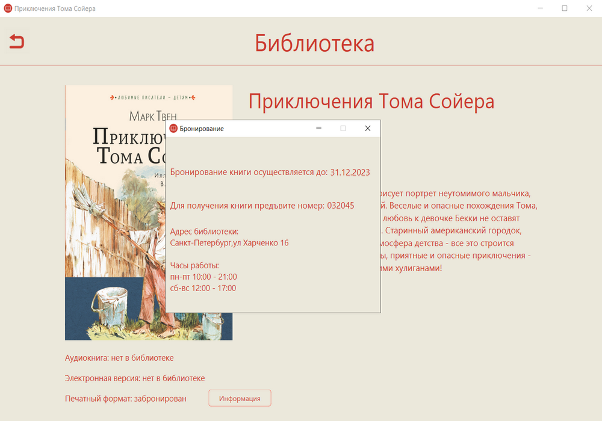

# Электронная библиотека

Приложение предоставляет пользователям доступ к электронным, печатным и аудиокнигам из библиотеки.
Также через аккаунт администратора, работники библиотеки могут осуществлять выдачу и возврат печатных книг.

## Стек технологий:
C++, Qt , MySQL, MySQL Connector/C++

## Скриншоты:
<details>
  <summary>Скриншоты</summary>

  Окно регистрации
<<<<<<< HEAD
  
  Окно входа
  
  Меню пользователя
  
  Библиотечные книги
  
  Информация о книге
  
  Книги пользователя
  
  Забронированная книга
  
  Главное окно администратора
  
=======
  
  Окно входа
  
  Меню пользователя
  
  Библиотечные книги
  
  Информация о книге
  
  Книги пользователя
  
  Забронированная книга
  
  Главное окно администратора
  
>>>>>>> 22347750ffe6ba02fbc516b7da7846f535ca8af2
</details>

## Запуск проекта:
1. Необходимо склонировать проект.
2. В папке DataBase находится LibraryDumb.sql , дамп базы данных приложения.
    Создаем новую базу данных с кодировкой utf8mb4_0900_ai_ci и в ней выполняем файл LibraryDumb.sql .
3. Заходим в проект и открываем файл Navigation.cpp, в следующих строчках меняем адрес сервера, логин,пороль и название базы данных:
```C++
    conn.reset(driver->connect("tcp://127.0.0.1:3306", "root", "password" ));
    conn->setSchema("digLib"); 
```
4. Скачиваем и устанавливаем MySQL Connector/C++ для работы с базой данных.  
[Гайд по установке](https://yandex.ru/video/preview/14604127341991293880) 
5. Подключаем к проекту QT.  
Необходимые компоненты Qt: core;gui;widgets;core5compat;sql;designer  
[Гайд по установке](https://www.youtube.com/watch?v=6bXrfVrYyxk)  

6. Запускаем проект
